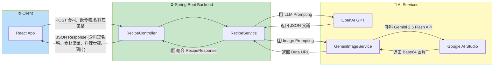

-----

# 🍳 Smart Chef AI 食譜推薦系統

## 🌟 專案簡介

**Smart Chef AI 食譜推薦系統** 是一個全端應用程式，旨在解決傳統食譜網站無法根據用戶的**現有食材、特定飲食要求 (如低碳、高蛋白)** 或**料理風格**進行客製化推薦的痛點。

本系統使用 **Java Spring Boot** 作為後端服務核心，透過 **AI 模型** 即時生成詳細、結構化的食譜 JSON 內容，並同步生成逼真的**料理預覽圖**，提供獨一無二的個人化烹飪體驗。

## ✨ 核心功能

  * **智能客製化食譜生成：** 接收用戶的**食材清單**、**料理風格**或**飲食需求** (例如：泰式、減脂、素食)，並生成詳細食譜。
  * **JSON 格式化輸出：** 利用 LLM 的 **JSON 模式 (JSON Mode)** 提示詞工程，確保食譜結構化輸出，便於前後端數據交換。
  * **AI 料理預覽圖：** 即時呼叫 **Google Gemini 2.5 Flash** API，根據食譜內容生成 Base64 編碼的成品圖片，增強用戶體驗。
  * **全端 RESTful API 架構：** 使用 Spring Boot 建立乾淨的 API 層，實現前後端分離，專注於服務編排。

## 🏛️ 系統架構 (System Architecture)

本專案採用 **服務編排 (Service Orchestration)** 架構，由 Spring Boot 後端統一協調多個 AI 服務，將複雜的生成過程包裝為單一 API 呼叫。





### 關鍵元件說明：

  * **RecipeController：** 負責接收前端的 `RecipeRequest` (食材, 風格)，處理 CORS 和路由 (`/api/recipe/generate`)。
  * **RecipeService：** **核心業務邏輯。** 負責編排流程，先利用 **Spring AI** (與 OpenAI 整合) 生成結構化食譜文字，再呼叫 `GeminiImageService` 獲取圖片。
  * **GeminiImageService：** 負責圖片生成，使用 **RestTemplate** 實作客製化 API 呼叫，整合 Google Gemini 2.5 Flash (Image Preview) 模型。
  * **DTOs：** 透過 `RecipeRequest` 和 `RecipeResponse` 確保資料傳輸格式清晰、可維護。

## 🛠️ 技術棧 (Tech Stack)

| 類別 | 技術/工具 | 備註 |
| :--- | :--- | :--- |
| **後端核心** | **Java 17+, Spring Boot 3.x** | 提供強健的後端服務和依賴注入 (DI)。 |
| **AI 服務層** | **Spring AI (OpenAI)** | 用於生成 JSON 格式的食譜內容。 |
| **AI 服務層** | **Google Gemini API** | 透過 RestTemplate 客製化呼叫 Gemini 2.5 Flash 進行圖片生成。 |
| **數據傳輸** | **Lombok, Jackson** | 簡化 POJO 撰寫，處理 JSON 序列化與反序列化。 |
| **後端通訊** | **RestTemplate** | 用於 `GeminiImageService` 中的外部 API 呼叫。 |
| **前端 (DEMO)** | **React.js** | 簡單的 UI/UX 展示層。 |
| **建構工具** | **Maven (pom.xml)** | 專案依賴管理。 |

## 🚀 專案運行

### 1\. 環境設定

1.  **Clone 專案**：
    ```bash
    git clone [您的 GitHub URL]
    cd recipe-ai
    ```
2.  **設定 API Keys**：
    在 Spring Boot 資源檔 (例如 `application.properties` 或 `application.yml`) 中設定以下兩個 API Keys：
    ```properties
    # 來自 OpenAI，供 Spring AI ChatModel 使用
    spring.ai.openai.api-key=[您的 OpenAI API Key]
    # 來自 Google AI Studio，供 GeminiImageService 使用
    # 註：此專案使用 RestTemplate 直接呼叫，但仍需配置 API Key
    spring.ai.google.gemini.api-key=[您的 Gemini API Key]
    ```

### 2\. 啟動後端 (Spring Boot)

1.  確保您的 Java 環境為 **JDK 17 或以上**。
2.  使用 Maven 運行 Spring Boot 應用程式：
    ```bash
    ./mvnw spring-boot:run
    ```
    後端服務將在 `http://localhost:8080` 啟動。

### 3\. 啟動前端 (React)

由於前端是一個簡單的 React App 結構，您需要手動處理其依賴和啟動：

1.  進入前端目錄 (假設您的 React 程式碼在 `/frontend` 或其他目錄)。
2.  安裝依賴 (假設使用 npm)：`npm install`
3.  啟動前端服務：`npm start`

### 4\. 測試 API

您可以使用 Postman 或前端介面測試 `POST` 請求到：

```
POST http://localhost:8080/api/recipe/generate
Content-Type: application/json
```

**Body (JSON):**

```json
{
  "ingredients": "雞胸肉, 青花菜, 醬油, 蒜頭",
  "styleOrDiet": "高蛋白，少油少鹽"
}
```

## ⏭️ 未來展望 (Future Enhancements)

為了將此專案推向生產環境，可以考慮以下增強：

1.  **資料庫持久化：** 儘管 `pom.xml` 中引入了 `spring-boot-starter-data-jpa` 和 `postgresql`，但目前食譜並未存儲。未來可加入 PostgreSQL 數據庫，實現**用戶帳號、食譜收藏**和**歷史紀錄**功能。
2.  **容器化部署：** 使用 **Docker** 容器化整個 Spring Boot 應用程式，簡化部署流程。
3.  **錯誤處理優化：** 在 `RecipeService.java` 中將錯誤處理標準化，例如使用 `@ControllerAdvice` 進行全域異常處理。
4.  **圖片生成優化：** 雖然使用了免費額度模型，但可升級到專門的付費 AI 繪圖服務（如 DALL-E 或 Midjourney API）以獲取更高品質的圖片。
5.  **前端框架整合：** 將前端的 API 呼叫 (`api.js`) 與 React 的狀態管理 (如 Redux/Context API) 更好地結合，並優化頁面渲染速度。
